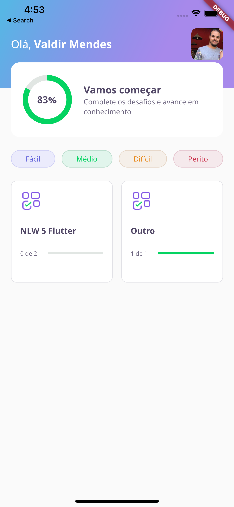
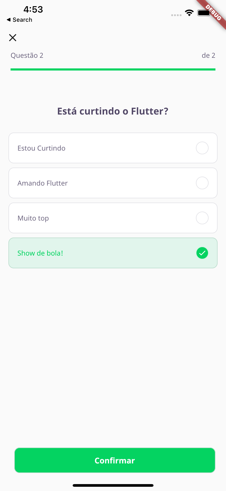
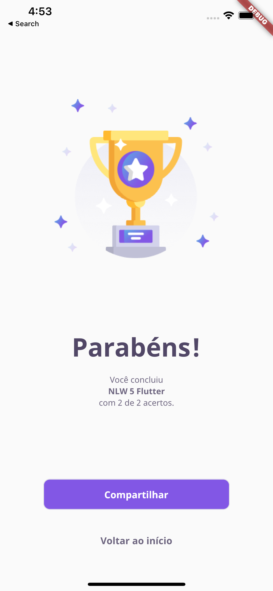

# DevQuiz - Flutter - NLW 5

Um aplicativo de questionário desenvolvido com flutter no projeto Next Level Week (NLW) da Rocketseat.

Neste projeto utilizamos coisas como:

  * Splash screen
  * Navegação de páginas
  * Gestão de estado
  * Animação

## Screenshots

